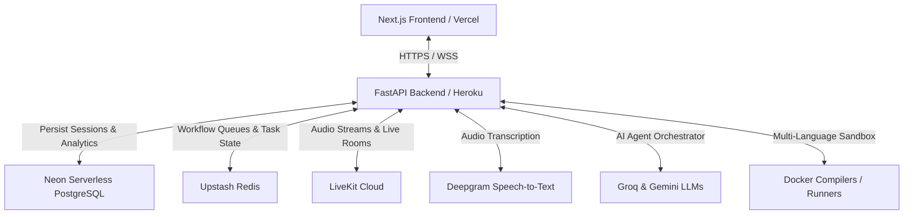

# InterviewOS AI 🚀

## **🌐 Live Platform Link: [https://interview-ai-gold-iota.vercel.app/](https://interview-ai-gold-iota.vercel.app/)**

---

**InterviewOS AI** is an advanced, enterprise-grade AI-powered technical interview and preparation platform. It simulates real-world coding and behavioral interview loops using state-of-the-art AI agents, live video/audio streams, multi-language sandbox compilation, and vector-based semantic memory.

---

## 🏗️ Architecture Overview



---

## ✨ Key Features

*   **🎙️ Real-time Audio/Video Mock Interviews**: Fully interactive interview rooms built on **LiveKit Cloud** and **Deepgram** for instant speech-to-text transcription.
*   **🤖 Multi-Agent Interview Panel**: Dedicated AI agents managing specific interview stages:
    *   **DSA Agent**: Evaluates algorithms and code execution.
    *   **Aptitude Agent**: Tests logical, reasoning, and quantitative skills.
    *   **Technical Agent**: Conducts system design and core concept discussions.
    *   **HR Agent**: Analyzes behavioral fit and communication skills.
*   **💻 Multi-Language Code Runner**: Internal sandbox compilation and execution engine supporting **Go, Rust, Swift, Kotlin, Java, Python, C#, PHP, Ruby, and JavaScript/TypeScript** (powered by Docker).
*   **🧠 Semantic memory (AI Memory)**: Retains interview performance history across sessions using **pgvector** vector embeddings stored directly in Neon DB.
*   **📊 Comprehensive Reports & Roadmaps**: Detailed candidate evaluation dashboards and personalized learning roadmaps.

---

## 🛠️ Tech Stack

### Frontend
*   **Framework**: Next.js 14 (App Router, TypeScript)
*   **Styling**: TailwindCSS & Tailwind Animate
*   **Animations**: Framer Motion
*   **State Management**: Zustand
*   **Communication**: LiveKit Client SDK

### Backend & Infrastructure
*   **API Framework**: FastAPI (Python)
*   **Database**: Neon PostgreSQL (with `pgvector` extension)
*   **ORM**: SQLAlchemy & Alembic (asyncpg)
*   **Worker & Queue**: Upstash Redis (Workflow execution engine)
*   **Orchestration**: LangGraph & LangChain (structured AI graphs)
*   **Hosting**: Vercel (Frontend), Heroku (Backend container runtime)

---

## 🚀 Local Setup & Installation

### Prerequisite Environment
Create a `.env` file in the root of the project for the frontend, and a `.env` file in the `interviewos-backend/` directory for the API.

#### 1. Backend Setup (`/interviewos-backend`)
1. Create a Python virtual environment:
   ```bash
   cd interviewos-backend
   python -m venv venv
   source venv/bin/activate  # On Windows: .\venv\Scripts\activate
   ```
2. Install dependencies:
   ```bash
   pip install -r requirements.txt
   ```
3. Copy `.env.example` to `.env` and fill in your API keys (Gemini, Groq, Neon, Upstash Redis, LiveKit, Deepgram).
4. Run the API server:
   ```bash
   uvicorn main:app --reload
   ```
5. Run the workflow worker:
   ```bash
   python -m workers.workflow_worker
   ```

#### 2. Frontend Setup (Root)
1. Install node packages:
   ```bash
   npm install
   ```
2. Configure `.env` in the root:
   ```env
   NEXT_PUBLIC_API_URL=http://127.0.0.1:8000
   ```
3. Run the development server:
   ```bash
   npm run dev
   ```

---

## 🌐 Production Deployment

### Heroku (Backend Container)
The backend uses a multi-compiler Docker environment. Deployment is configured using `heroku.yml` and `Dockerfile.heroku`:
```bash
# Set stack to container
heroku stack:set container -a your-app-name

# Deploy
git push heroku main

# Scale dynos
heroku ps:scale web=1 worker=1 -a your-app-name
```

### Vercel (Frontend)
Deploy the Next.js app on Vercel with `NEXT_PUBLIC_API_URL` pointing to your Heroku app.
